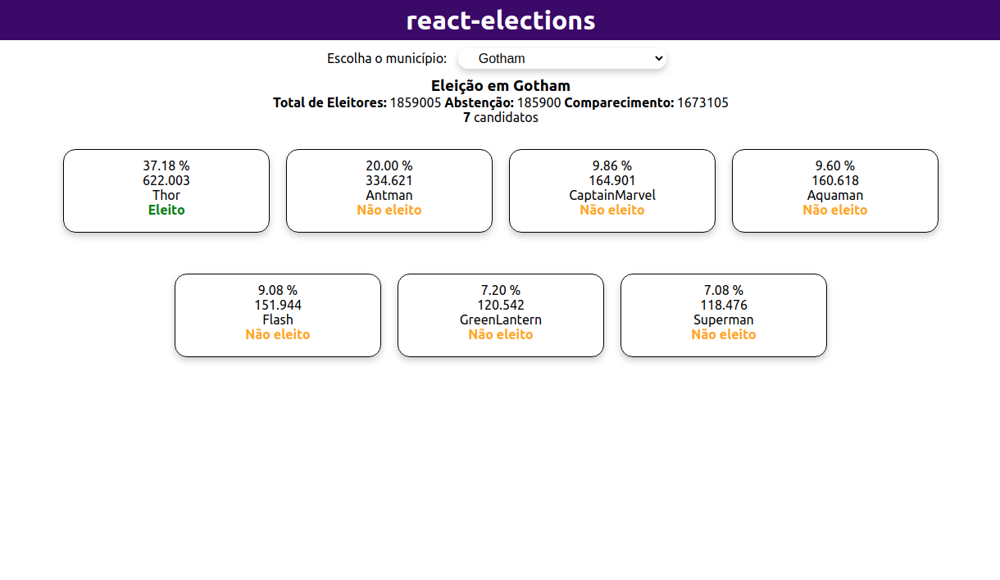
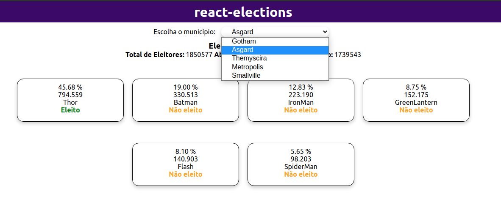

# Desafio Modulo II - Modulo React I

Este projeto foi desenvolvido durante o modulo II do bootcamp de Desenvolvedor React da IGTI, tema foi proposto e o desafio era pra nós estudantes fazer, o IGTI forneceu apenas os dados do BackEnd.

## Projeto React Elections

O sistema le os dados do BackEnd e calcula o 
candidato que teve mais votos, calculando o seu percentual, com isso o sistema identifica o candidato eleito.

## Tecnologias

Este projeto foi desenvolvido com as seguintes tecnologias:

- [React]
- [Node]
- [Json-Server]

                                                     
## Demonstração
 



<br></br>



## Como usar

```
# Clone este repositório
$ git clone https://github.com/marlenesedano/react-elections.git
# Acesse o diretório do projeto


# Instale as dependências
$ yarn install

# Inicie a aplicação Json-Server com os arquivos
que estão dentro da pasta BackEnd
$ yarn start

# O site vai estar disponível na porta 3004
```
